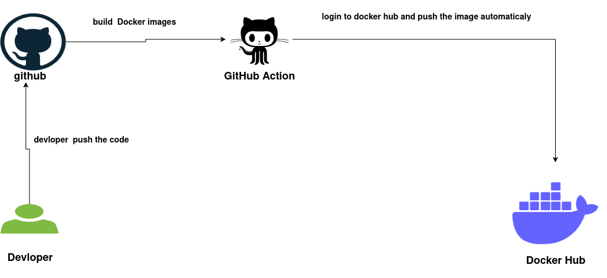

# 🚀 Day 40: CI/CD with Flask + Docker + GitHub Actions | #100DaysOfDevOps

Welcome to **Day 40** of my [#100DaysOfDevOps](https://github.com/ritesh355/Devops-journal)! Today, I built a **CI/CD pipeline** for a Python **Flask** application, containerized it with **Docker**, and automated the build and deployment process using **GitHub Actions**. Let’s dive into this exciting journey! 🐍🐳💥 #DevOps #CI/CD

---

## WROKFLOW


---

<!--[if IE]><meta http-equiv="X-UA-Compatible" content="IE=5,IE=9" ><![endif]-->
<!DOCTYPE html>
<html>
<head>
<title>Untitled Diagram.drawio.html</title>
<meta charset="utf-8"/>
</head>
<body>
<div class="mxgraph" style="max-width:100%;border:1px solid transparent;" data-mxgraph="{&quot;highlight&quot;:&quot;#0000ff&quot;,&quot;nav&quot;:true,&quot;resize&quot;:true,&quot;xml&quot;:&quot;&lt;mxfile host=\&quot;app.diagrams.net\&quot; agent=\&quot;Mozilla/5.0 (X11; Ubuntu; Linux x86_64; rv:143.0) Gecko/20100101 Firefox/143.0\&quot; version=\&quot;28.2.4\&quot; pages=\&quot;2\&quot;&gt;&lt;diagram name=\&quot;Page-1\&quot; id=\&quot;8ny_mlcMW7RtcgiFrXhl\&quot;&gt;&lt;mxGraphModel dx=\&quot;1356\&quot; dy=\&quot;800\&quot; grid=\&quot;1\&quot; gridSize=\&quot;11\&quot; guides=\&quot;1\&quot; tooltips=\&quot;1\&quot; connect=\&quot;1\&quot; arrows=\&quot;1\&quot; fold=\&quot;1\&quot; page=\&quot;1\&quot; pageScale=\&quot;1\&quot; pageWidth=\&quot;850\&quot; pageHeight=\&quot;1100\&quot; math=\&quot;0\&quot; shadow=\&quot;0\&quot;&gt;&lt;root&gt;&lt;mxCell id=\&quot;0\&quot;/&gt;&lt;mxCell id=\&quot;1\&quot; parent=\&quot;0\&quot;/&gt;&lt;mxCell id=\&quot;CYVdjwq6OV4buT366xgc-11\&quot; style=\&quot;edgeStyle=orthogonalEdgeStyle;rounded=0;orthogonalLoop=1;jettySize=auto;html=1;\&quot; edge=\&quot;1\&quot; parent=\&quot;1\&quot; source=\&quot;SHCiTcQlrak87rCp9xaC-1\&quot; target=\&quot;PP_0jaeZbNW0dbfRGlEJ-14\&quot;&gt;&lt;mxGeometry relative=\&quot;1\&quot; as=\&quot;geometry\&quot;/&gt;&lt;/mxCell&gt;&lt;mxCell id=\&quot;SHCiTcQlrak87rCp9xaC-1\&quot; value=\&quot;vjr\&quot; style=\&quot;dashed=0;outlineConnect=0;html=1;align=center;labelPosition=center;verticalLabelPosition=bottom;verticalAlign=top;shape=mxgraph.weblogos.github;fillColor=#F45B69;strokeColor=#028090;labelBackgroundColor=none;fontColor=#E4FDE1;\&quot; parent=\&quot;1\&quot; vertex=\&quot;1\&quot;&gt;&lt;mxGeometry x=\&quot;43\&quot; y=\&quot;44\&quot; width=\&quot;111\&quot; height=\&quot;97\&quot; as=\&quot;geometry\&quot;/&gt;&lt;/mxCell&gt;&lt;mxCell id=\&quot;t8o80UmgTZDarvIJXSef-4\&quot; value=\&quot;&amp;lt;h2&amp;gt;github&amp;lt;/h2&amp;gt;\&quot; style=\&quot;text;html=1;align=center;verticalAlign=middle;resizable=0;points=[];autosize=1;strokeColor=none;fillColor=none;\&quot; parent=\&quot;1\&quot; vertex=\&quot;1\&quot;&gt;&lt;mxGeometry x=\&quot;52.5\&quot; y=\&quot;121\&quot; width=\&quot;80\&quot; height=\&quot;60\&quot; as=\&quot;geometry\&quot;/&gt;&lt;/mxCell&gt;&lt;mxCell id=\&quot;t8o80UmgTZDarvIJXSef-8\&quot; value=\&quot;\&quot; style=\&quot;sketch=0;pointerEvents=1;shadow=0;dashed=0;html=1;strokeColor=none;labelPosition=center;verticalLabelPosition=bottom;verticalAlign=top;outlineConnect=0;align=center;shape=mxgraph.office.users.user;fillColor=#7FBA42;\&quot; parent=\&quot;1\&quot; vertex=\&quot;1\&quot;&gt;&lt;mxGeometry x=\&quot;43\&quot; y=\&quot;368\&quot; width=\&quot;99\&quot; height=\&quot;50\&quot; as=\&quot;geometry\&quot;/&gt;&lt;/mxCell&gt;&lt;mxCell id=\&quot;t8o80UmgTZDarvIJXSef-10\&quot; value=\&quot;&amp;lt;h2&amp;gt;Devloper&amp;lt;/h2&amp;gt;\&quot; style=\&quot;text;html=1;align=center;verticalAlign=middle;resizable=0;points=[];autosize=1;strokeColor=none;fillColor=none;\&quot; parent=\&quot;1\&quot; vertex=\&quot;1\&quot;&gt;&lt;mxGeometry x=\&quot;43\&quot; y=\&quot;429\&quot; width=\&quot;100\&quot; height=\&quot;60\&quot; as=\&quot;geometry\&quot;/&gt;&lt;/mxCell&gt;&lt;mxCell id=\&quot;t8o80UmgTZDarvIJXSef-13\&quot; value=\&quot;\&quot; style=\&quot;shape=image;html=1;verticalAlign=top;verticalLabelPosition=bottom;labelBackgroundColor=#ffffff;imageAspect=0;aspect=fixed;image=https://icons.diagrams.net/icon-cache1/Unicons_Line_vol_3-2965/docker-1335.svg\&quot; parent=\&quot;1\&quot; vertex=\&quot;1\&quot;&gt;&lt;mxGeometry x=\&quot;896.5\&quot; y=\&quot;297\&quot; width=\&quot;175\&quot; height=\&quot;175\&quot; as=\&quot;geometry\&quot;/&gt;&lt;/mxCell&gt;&lt;mxCell id=\&quot;t8o80UmgTZDarvIJXSef-14\&quot; value=\&quot;&amp;lt;h2&amp;gt;Docker Hub&amp;lt;/h2&amp;gt;\&quot; style=\&quot;text;html=1;align=center;verticalAlign=middle;resizable=0;points=[];autosize=1;strokeColor=none;fillColor=none;\&quot; parent=\&quot;1\&quot; vertex=\&quot;1\&quot;&gt;&lt;mxGeometry x=\&quot;924\&quot; y=\&quot;434\&quot; width=\&quot;120\&quot; height=\&quot;60\&quot; as=\&quot;geometry\&quot;/&gt;&lt;/mxCell&gt;&lt;mxCell id=\&quot;t8o80UmgTZDarvIJXSef-19\&quot; value=\&quot;&amp;lt;h2&amp;gt;GitHub Action&amp;lt;/h2&amp;gt;\&quot; style=\&quot;text;html=1;align=center;verticalAlign=middle;resizable=0;points=[];autosize=1;strokeColor=none;fillColor=none;\&quot; parent=\&quot;1\&quot; vertex=\&quot;1\&quot;&gt;&lt;mxGeometry x=\&quot;412\&quot; y=\&quot;121\&quot; width=\&quot;140\&quot; height=\&quot;60\&quot; as=\&quot;geometry\&quot;/&gt;&lt;/mxCell&gt;&lt;mxCell id=\&quot;PP_0jaeZbNW0dbfRGlEJ-7\&quot; style=\&quot;edgeStyle=orthogonalEdgeStyle;rounded=0;orthogonalLoop=1;jettySize=auto;html=1;entryX=0.422;entryY=0.667;entryDx=0;entryDy=0;entryPerimeter=0;fontStyle=0\&quot; parent=\&quot;1\&quot; source=\&quot;t8o80UmgTZDarvIJXSef-8\&quot; target=\&quot;t8o80UmgTZDarvIJXSef-4\&quot; edge=\&quot;1\&quot;&gt;&lt;mxGeometry relative=\&quot;1\&quot; as=\&quot;geometry\&quot;/&gt;&lt;/mxCell&gt;&lt;mxCell id=\&quot;CYVdjwq6OV4buT366xgc-9\&quot; style=\&quot;edgeStyle=orthogonalEdgeStyle;rounded=0;orthogonalLoop=1;jettySize=auto;html=1;\&quot; edge=\&quot;1\&quot; parent=\&quot;1\&quot; source=\&quot;PP_0jaeZbNW0dbfRGlEJ-14\&quot; target=\&quot;t8o80UmgTZDarvIJXSef-13\&quot;&gt;&lt;mxGeometry relative=\&quot;1\&quot; as=\&quot;geometry\&quot;&gt;&lt;mxPoint x=\&quot;1012\&quot; y=\&quot;88.25\&quot; as=\&quot;targetPoint\&quot;/&gt;&lt;/mxGeometry&gt;&lt;/mxCell&gt;&lt;mxCell id=\&quot;PP_0jaeZbNW0dbfRGlEJ-14\&quot; value=\&quot;\&quot; style=\&quot;shape=image;html=1;verticalAlign=top;verticalLabelPosition=bottom;labelBackgroundColor=#ffffff;imageAspect=0;aspect=fixed;image=https://icons.diagrams.net/icon-cache1/Picons_Social-2097/github-687.svg\&quot; parent=\&quot;1\&quot; vertex=\&quot;1\&quot;&gt;&lt;mxGeometry x=\&quot;425\&quot; y=\&quot;31.25\&quot; width=\&quot;114\&quot; height=\&quot;114\&quot; as=\&quot;geometry\&quot;/&gt;&lt;/mxCell&gt;&lt;mxCell id=\&quot;CYVdjwq6OV4buT366xgc-3\&quot; value=\&quot;&amp;lt;h3&amp;gt;&amp;lt;b&amp;gt;devloper&amp;amp;nbsp; push the code&amp;amp;nbsp;&amp;lt;/b&amp;gt;&amp;lt;/h3&amp;gt;\&quot; style=\&quot;text;html=1;align=center;verticalAlign=middle;resizable=0;points=[];autosize=1;strokeColor=none;fillColor=none;\&quot; vertex=\&quot;1\&quot; parent=\&quot;1\&quot;&gt;&lt;mxGeometry x=\&quot;88\&quot; y=\&quot;231\&quot; width=\&quot;187\&quot; height=\&quot;55\&quot; as=\&quot;geometry\&quot;/&gt;&lt;/mxCell&gt;&lt;mxCell id=\&quot;CYVdjwq6OV4buT366xgc-6\&quot; value=\&quot;&amp;lt;h3&amp;gt;&amp;lt;b&amp;gt;build&amp;amp;nbsp; Docker images&amp;lt;/b&amp;gt;&amp;lt;/h3&amp;gt;\&quot; style=\&quot;text;html=1;align=center;verticalAlign=middle;resizable=0;points=[];autosize=1;strokeColor=none;fillColor=none;\&quot; vertex=\&quot;1\&quot; parent=\&quot;1\&quot;&gt;&lt;mxGeometry x=\&quot;187\&quot; y=\&quot;31.25\&quot; width=\&quot;165\&quot; height=\&quot;55\&quot; as=\&quot;geometry\&quot;/&gt;&lt;/mxCell&gt;&lt;mxCell id=\&quot;CYVdjwq6OV4buT366xgc-8\&quot; value=\&quot;&amp;lt;h3&amp;gt;login to docker hub and push the image automaticaly&amp;lt;/h3&amp;gt;\&quot; style=\&quot;text;html=1;align=center;verticalAlign=middle;resizable=0;points=[];autosize=1;strokeColor=none;fillColor=none;\&quot; vertex=\&quot;1\&quot; parent=\&quot;1\&quot;&gt;&lt;mxGeometry x=\&quot;572\&quot; y=\&quot;22\&quot; width=\&quot;385\&quot; height=\&quot;55\&quot; as=\&quot;geometry\&quot;/&gt;&lt;/mxCell&gt;&lt;/root&gt;&lt;/mxGraphModel&gt;&lt;/diagram&gt;&lt;diagram id=\&quot;3lqT6wDxEMe3HjZ38DT5\&quot; name=\&quot;Page-2\&quot;&gt;&amp;#xa;    &lt;mxGraphModel dx=\&quot;1356\&quot; dy=\&quot;800\&quot; grid=\&quot;1\&quot; gridSize=\&quot;10\&quot; guides=\&quot;1\&quot; tooltips=\&quot;1\&quot; connect=\&quot;1\&quot; arrows=\&quot;1\&quot; fold=\&quot;1\&quot; page=\&quot;1\&quot; pageScale=\&quot;1\&quot; pageWidth=\&quot;850\&quot; pageHeight=\&quot;1100\&quot; math=\&quot;0\&quot; shadow=\&quot;0\&quot;&gt;&amp;#xa;      &lt;root&gt;&amp;#xa;        &lt;mxCell id=\&quot;0\&quot;/&gt;&amp;#xa;        &lt;mxCell id=\&quot;1\&quot; parent=\&quot;0\&quot;/&gt;&amp;#xa;      &lt;/root&gt;&amp;#xa;    &lt;/mxGraphModel&gt;&amp;#xa;  &lt;/diagram&gt;&lt;/mxfile&gt;&quot;,&quot;toolbar&quot;:&quot;pages zoom layers lightbox&quot;,&quot;page&quot;:0}"></div>
<script type="text/javascript" src="https://app.diagrams.net/js/viewer-static.min.js"></script>
</body>
</html>

---

## 🔧 Project Overview: Flask App with Docker CI/CD

The goal of this project is to create a simple Flask application, containerize it using Docker, and set up a GitHub Actions workflow to automatically build and push the Docker image to Docker Hub whenever code is pushed to the `main` branch. #Flask #Docker #GitHubActions

---

## 🗂 Project Structure

Here’s the structure of the project:

```
flask-ci-cd-demo/
├── app/
│   ├── app.py           # Flask app logic
│   └── requirements.txt # Python dependencies
├── Dockerfile           # Docker configuration
├── .dockerignore        # Ignore unnecessary files in Docker context
├── .gitignore           # Ignore local dev/config files
├── .github/
│   └── workflows/
│       └── ci-cd.yml    # GitHub Actions workflow file
└── README.md            # Project details
```

---

## 🛠️ Step 1: Set Up the Project

Create the project directory and initialize a Python environment:

```bash
mkdir flask-ci-cd-demo && cd flask-ci-cd-demo
mkdir app
```

---

## 🐍 Step 2: Create the Flask Application

### `app/app.py`
Create a simple Flask app:

```python
from flask import Flask
app = Flask(__name__)

@app.route("/")
def home():
    return "🚀 Hello from Flask CI/CD Pipeline!"

if __name__ == "__main__":
    app.run(host="0.0.0.0", port=5000)
```

This code sets up a Flask server that responds with a message at `http://localhost:5000`. #Python #Flask

### `app/requirements.txt`
List the dependencies:

```text
flask
```

---

## 🐳 Step 3: Create the Dockerfile

Create a `Dockerfile` to containerize the Flask app:

```dockerfile
# Use official Python image
FROM python:3.10-slim

# Set work directory
WORKDIR /app

# Copy files and install dependencies
COPY app/requirements.txt .
RUN pip install --no-cache-dir -r requirements.txt

# Copy source code
COPY app/ .

# Run the Flask app
CMD ["python", "app.py"]
```

**Why this structure?**
- Using `python:3.10-slim` keeps the image lightweight.
- Copying `requirements.txt` first allows Docker to cache the dependency layer, speeding up builds if only `app.py` changes. #Docker #Optimization

---

## 📦 Step 4: Optimize with `.dockerignore` and `.gitignore`

### `.dockerignore`
Prevent unnecessary files from being included in the Docker image:

```text
# Git and version control
.git
.gitignore

# Python bytecode
__pycache__/
*.pyc

# Virtual environments
env/
venv/
ENV/

# Editor settings
.vscode/
.idea/

# System files
.DS_Store

# GitHub Actions config
.github/
```

### `.gitignore`
Ignore local development and temporary files:

```text
# Python
__pycache__/
*.pyc
*.pyo
*.pyd
env/
venv/
ENV/
*.env

# Editor settings
.vscode/
.idea/

# System files
.DS_Store
Thumbs.db

# Logs
*.log

# Docker artifacts
*.tar
```

These files ensure clean builds and repositories by excluding irrelevant files. #BestPractices

---

## ⚙️ Step 5: Set Up GitHub Actions Workflow

Create the workflow file at `.github/workflows/ci-cd.yml`:

```yaml
name: Flask CI/CD

on:
  push:
    branches:
      - main

jobs:
  build-and-deploy:
    runs-on: ubuntu-latest

    steps:
      - name: 📥 Checkout code
        uses: actions/checkout@v4

      - name: 🐍 Set up Python
        uses: actions/setup-python@v5
        with:
          python-version: '3.10'

      - name: 📦 Install dependencies
        run: pip install -r app/requirements.txt

      - name: ✅ Run tests
        run: echo "No tests yet"

      - name: 🐳 Build Docker image
        run: docker build -t ritesh355/flask-ci-cd-demo .

      - name: 📤 Push to Docker Hub
        run: |
          echo "${{ secrets.DOCKER_PASSWORD }}" | docker login -u "${{ secrets.DOCKER_USERNAME }}" --password-stdin
          docker tag ritesh355/flask-ci-cd-demo ritesh355/flask-ci-cd-demo:latest
          docker push ritesh355/flask-ci-cd-demo:latest
```

**Key Points**:
- Triggers on pushes to the `main` branch.
- Sets up Python 3.10 and installs dependencies.
- Builds the Docker image and pushes it to Docker Hub.
- Uses GitHub Secrets for secure Docker Hub authentication. #GitHubActions #Automation

---

## 🔐 Step 6: Configure Docker Hub Secrets

To enable Docker Hub pushes, add these secrets to your GitHub repository:
- `DOCKER_USERNAME`: Your Docker Hub username (`ritesh355`).
- `DOCKER_PASSWORD`: Your Docker Hub access token (not your password).

Add them via:
1. Go to GitHub Repo → **Settings** → **Secrets and variables** → **Actions**.
2. Click **New repository secret** and add `DOCKER_USERNAME` and `DOCKER_PASSWORD`. #Security #DockerHub

---

## 🚀 Step 7: Push to GitHub

Push your project to GitHub:

```bash
git init
git remote add origin https://github.com/ritesh355/flask-ci-cd-demo.git
git add .
git commit -m "Add Flask CI/CD demo with Docker and GitHub Actions"
git push -u origin main
```

---

## ✅ Step 8: Verify the CI/CD Pipeline

1. Go to your GitHub repo → **Actions** tab.
2. Watch the **Flask CI/CD** workflow run. It will:
   - Install Python dependencies.
   - Build the Docker image.
   - Push the image to `ritesh355/flask-ci-cd-demo:latest` on Docker Hub.
3. Visit [Docker Hub](https://hub.docker.com/u/ritesh355) to confirm the image is published.

---

## 🧪 Step 9: Test the Docker Image Locally

To verify the image, run it locally (if you have Docker installed):

```bash
docker pull ritesh355/flask-ci-cd-demo:latest
docker run -p 5000:5000 ritesh355/flask-ci-cd-demo
```

Open your browser and visit [http://localhost:5000](http://localhost:5000). You should see:

**"🚀 Hello from Flask CI/CD Pipeline!"**

---

## 📌 Learnings from Day 13

- Built an end-to-end **CI/CD pipeline** for a Flask app using GitHub Actions.
- Used `.dockerignore` and `.gitignore` to optimize Docker builds and keep the repository clean.
- Secured Docker Hub credentials with **GitHub Secrets**.
- Automated Docker image builds and pushes to Docker Hub. #Learning #DevOpsJourney

---

## 📈 Benefits

- **Automation**: Push code, and GitHub Actions handles the rest.
- **Efficiency**: `.dockerignore` reduces image size and build time.
- **Security**: Sensitive credentials are safely stored in GitHub Secrets.
- **Scalability**: Ready to extend with tests or deployment steps.

---

## 🔗 Useful Links

- 💻 [GitHub Repo](https://github.com/ritesh355/flask-ci-cd-demo)
- 📦 [Docker Hub](https://hub.docker.com/u/ritesh355)
- ✍️ [My Blog](https://ritesh-devops.hashnode.dev)

#Portfolio #Networking

---

## 🎉 Congratulations!

You’ve successfully built a **CI/CD pipeline** for a Flask app with Docker and GitHub Actions! Keep rocking your #100DaysOfDevOps journey! 💪 #KeepLearning

> **Need help?** Drop a comment or question, and I’ll guide you through any issues!
